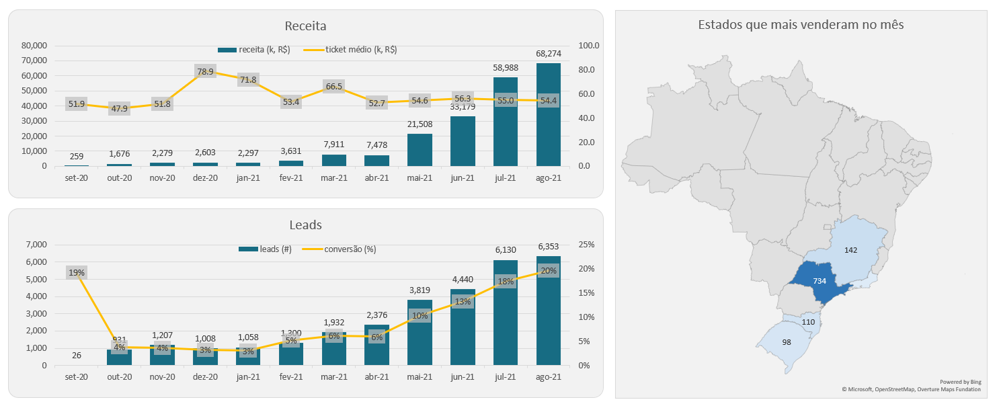
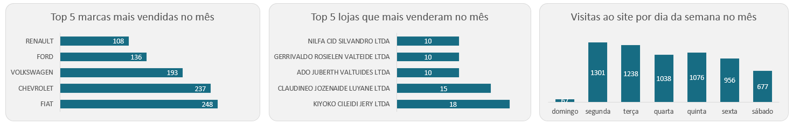
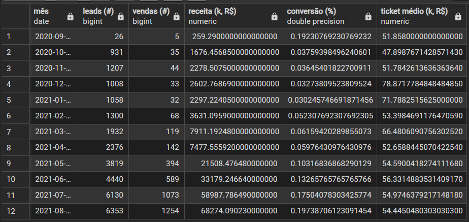
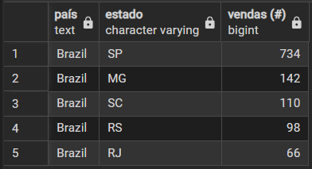
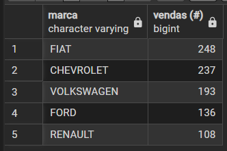
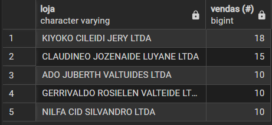
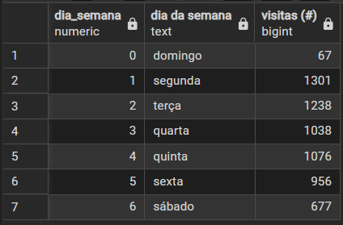

# 📊 Dashboard de Vendas — Análise SQL

Este projeto contém as queries SQL utilizadas para alimentar um dashboard de análise comercial, com foco em receita, conversão, performance por estado, marca, loja e comportamento de visitas ao site.

---

## 🗂️ Estrutura do Projeto

```
📁 projeto-sql-dashboard
│
├── queries/
│   ├── 01_receita_leads_conversao.sql
│   ├── 02_estados_mais_venderam.sql
│   ├── 03_marcas_mais_venderam.sql
│   ├── 04_lojas_mais_venderam.sql
│   └── 05_visitas_dia_semana.sql
│
└── README.md
```

---

## 📸 Dashboard




---

## 🔍 Queries

### Query 1 — Receita, Leads, Conversão e Ticket Médio (Mês a Mês)

Consolida os principais indicadores de performance comercial agrupados por mês.

**Colunas retornadas:** `mês`, `leads (#)`, `vendas (#)`, `receita (k, R$)`, `conversão (%)`, `ticket médio (k, R$)`

```sql
-- (Query 1) Receita, leads, conversão e ticket médio mês a mês
with 
    leads as (
        select
            date_trunc('month', visit_page_date)::date as visit_page_month,
            count(*) as visit_page_count
        from sales.funnel
        group by visit_page_month
        order by visit_page_month
    ),
    
    payments as (
        select
            date_trunc('month', fun.paid_date)::date as paid_month,
            count(fun.paid_date) as paid_count,
            sum(pro.price * (1+fun.discount)) as receita
        from sales.funnel as fun
        left join sales.products as pro
            on fun.product_id = pro.product_id
        where fun.paid_date is not null
        group by paid_month
        order by paid_month
    )
    
select
    leads.visit_page_month as "mês",
    leads.visit_page_count as "leads (#)",
    payments.paid_count as "vendas (#)",
    (payments.receita/1000) as "receita (k, R$)",
    (payments.paid_count::float/leads.visit_page_count::float) as "conversão (%)",
    (payments.receita/payments.paid_count/1000) as "ticket médio (k, R$)"
from leads
left join payments
    on leads.visit_page_month = paid_month
```



---

### Query 2 — Estados que Mais Venderam

Ranking dos 5 estados com maior volume de vendas no mês de agosto/2021.

**Colunas retornadas:** `país`, `estado`, `vendas (#)`

```sql
-- (Query 2) Estados que mais venderam
select
    'Brazil' as país,
    cus.state as estado,
    count(fun.paid_date) as "vendas (#)"
from sales.funnel as fun
left join sales.customers as cus
    on fun.customer_id = cus.customer_id
where paid_date between '2021-08-01' and '2021-08-31'
group by país, estado
order by "vendas (#)" desc
limit 5
```



---

### Query 3 — Marcas que Mais Venderam no Mês

Top 5 marcas com maior número de vendas em agosto/2021.

**Colunas retornadas:** `marca`, `vendas (#)`

```sql
-- (Query 3) Marcas que mais venderam no mês
select
    pro.brand as marca,
    count(fun.paid_date) as "vendas (#)"
from sales.funnel as fun
left join sales.products as pro
    on fun.product_id = pro.product_id
where paid_date between '2021-08-01' and '2021-08-31'
group by marca
order by "vendas (#)" desc
limit 5
```



---

### Query 4 — Lojas que Mais Venderam

Top 5 lojas com maior volume de vendas em agosto/2021.

**Colunas retornadas:** `loja`, `vendas (#)`

```sql
-- (Query 4) Lojas que mais venderam
select
    sto.store_name as loja,
    count(fun.paid_date) as "vendas (#)"
from sales.funnel as fun
left join sales.stores as sto
    on fun.store_id = sto.store_id
where paid_date between '2021-08-01' and '2021-08-31'
group by loja
order by "vendas (#)" desc
limit 5
```



---

### Query 5 — Dias da Semana com Maior Número de Visitas ao Site

Distribuição de visitas ao site por dia da semana em agosto/2021.

**Colunas retornadas:** `dia_semana`, `dia da semana`, `visitas (#)`

```sql
-- (Query 5) Dias da semana com maior número de visitas ao site
select
    extract('dow' from visit_page_date) as dia_semana,
    case 
        when extract('dow' from visit_page_date)=0 then 'domingo'
        when extract('dow' from visit_page_date)=1 then 'segunda'
        when extract('dow' from visit_page_date)=2 then 'terça'
        when extract('dow' from visit_page_date)=3 then 'quarta'
        when extract('dow' from visit_page_date)=4 then 'quinta'
        when extract('dow' from visit_page_date)=5 then 'sexta'
        when extract('dow' from visit_page_date)=6 then 'sábado'
        else null end as "dia da semana",
    count(*) as "visitas (#)"
from sales.funnel
where visit_page_date between '2021-08-01' and '2021-08-31'
group by dia_semana
order by dia_semana
```



---

## 🗃️ Fonte de Dados

As queries utilizam as seguintes tabelas do schema `sales`:

| Tabela | Descrição |
|--------|-----------|
| `sales.funnel` | Registro de visitas, leads e vendas do funil comercial |
| `sales.products` | Cadastro de produtos com preço e marca |
| `sales.customers` | Dados dos clientes, incluindo estado |
| `sales.stores` | Cadastro das lojas |

---

## 🛠️ Tecnologias

- **PostgreSQL** — banco de dados relacional utilizado nas queries
- **SQL** — linguagem de consulta para extração e transformação dos dados

---

## Desenvolvedor

| [<br><sub>João Pedro Martins</sub>](https://github.com/jotap53) |
| :---: |
